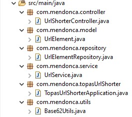
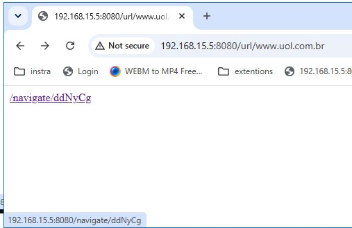

### linkShorter-project

#####Visão geral do linkShorter-project 

Este projeto tem como objetivo realizar a compressão de links informados pela API que por sua devolve uma versão comprimida clicavel do link. 
Uma vez o link comprimido é clicado o mesmo redireciona imediatamente para a página desejada exemplo - https://www.uol.com.br/ 

O projeto Atualmente conta com duas APIs.
/url/[original-web-site-address]  - GET method
- Responsável por receber o endereço que deve ser comprimido. 
- E por sua vez gerar caso o mesmo não exista ou retornar caso exista.
- E finalmente enviar para a o navegador que o chamou o link abreviado o qual o usuário final pode acessar.

/navigate/[Link-Alias] – Get method
- Responsável por realizar a conversão do link abreviado (Alias) para o endereço original que por sua vez e redirecionado para o link final.  

##### Estrutura de pastas utilizada 

O projeto foi estruturado utilizando a estrutura MVC (Model, View, Controler).

O qual a logica de negocio e orquestrada pela classe de serviço  **UrlService.java**  que interage com a classe  **Base62Utils.java**  para gerar a string codificada e com o
**UrlElementRepository.java**  que faz a gravacao e a leitura dos dados no banco de dados relacional utilizando postgress.

##### Fluxo 

Quando o link e submetido pelo controller **(Utilizando a barra de endereços do navegador)** a classe de serviço realiza o encode do link e verifica no banco de dados se o mesmo já este previamente registrado caso não esteja um novo registro então e criado no banco de dados utilizando o link original juntamente com o encode criado. E os valores gravados retornados para o controller que por sua vez chama um outro método da classe de serviço para gerar um link para que o usuário possa clicar na tela. 

Ao clicar no link mencionado na foto acima o usuário e encaminhado para /navigate/[Link-Alias] que por sua vez ira ser levado ao link original.

##### Tecnologias utilizadas

As seguintes ferramentas foram utilizadas na construção desse projeto

- Java 17
- Spring Boot 4.0
- PosgressSQL
- Eclipse IDE

##### Execultar o projeto

- Clone o projeto do seguinte repositorio utilizando o comando git-clone para o seguinte repositorio  https://github.com/gabriekq/linkShorter-project.git
- No eclipse clique em **abrir projetos do sistema de arquivos** terceira opcao no menu arquivo de cima para baixo.
- No menu que abrir selecione o caminho da pasta que foi criada pelo comando Git Clone.
- Clique em **avancar** ou em **finished**
- Aguarde o projeto realizar o build. 
- Execulte o arquivo **TopasUrlShorterApplication.java**

 
